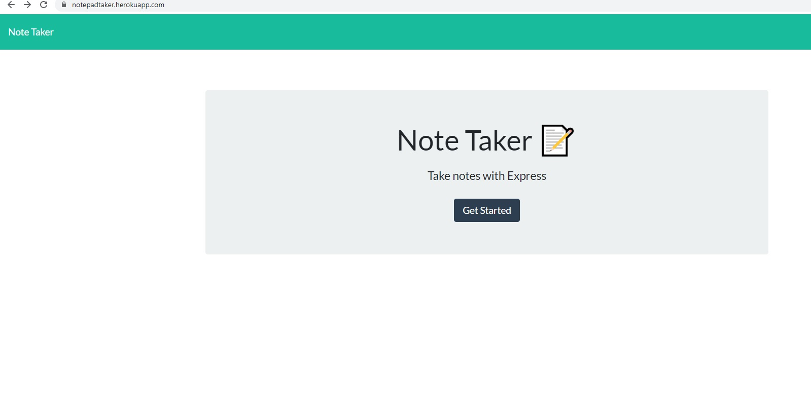

# notepad

 This application functions as an electronic notepad so that uses can keep track of lists.
 The user is able to save notes and then retrieve them later.
 The use is able to delete a note.  All notes are saved in a json file name db.json
 The frontend is using nodejs and html.  The backend server is Express.
 The reading and writing of data to and from the db.json is performed by the npm package fs.
 

## Business Context

For users that need to keep track of a lot of information, it's easy to forget or be unable to recall something important. Being able to take persistent notes allows users to have written information available when needed.

## Acceptance Criteria

Application should allow users to create and save notes.

Application should allow users to view previously saved notes.

Application should allow users to delete previously saved notes.

